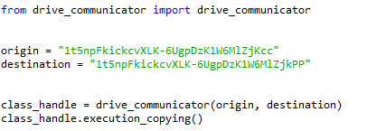

# Copy All Google Drive Code
Project to copy a all folders and files from a google drive to a google shared drive

This class enables the user to copy over all folders and files from a google drive location to another. Normally google drive does not all allow the user to copy folders,
instead the user has to manually recreate the folder structure. This script automates that task. 

To start please check this video to set up and enable a python script to use your google drive account
https://developers.google.com/drive/api/v3/quickstart/python

Once the API is set-up, we can find the folder/drive we want to copy and the folder/drive where we want to copy the files to. For this task, please navigate in your 
google drive account to the folders you want to copy. Your url to your location should look something like this:

The location for the script is then   
origin = "1t5npFkickcvXLK-6UgpDzK1W6MlZjKcc"   
In other words, we only need the long string after folders/ to find the right location. The same holds for the destination. 

The final code should then look like this:  

With that you are ready to go. 
